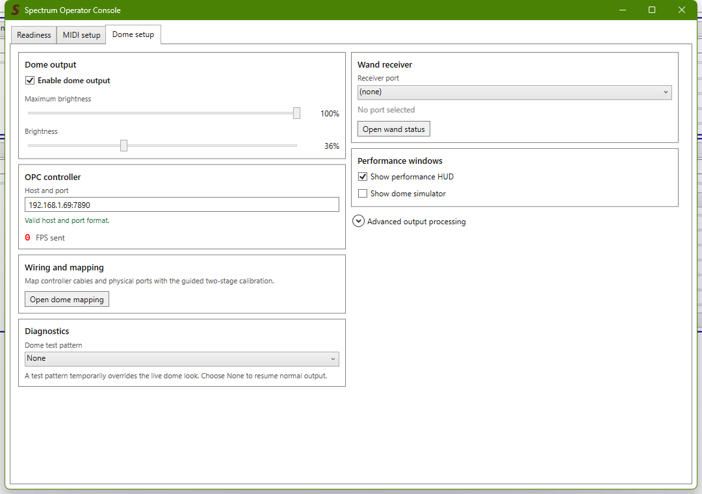
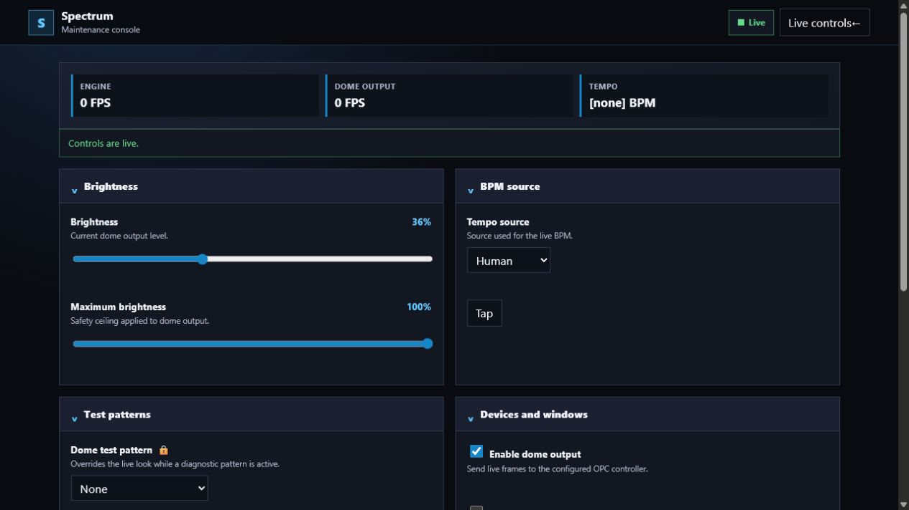
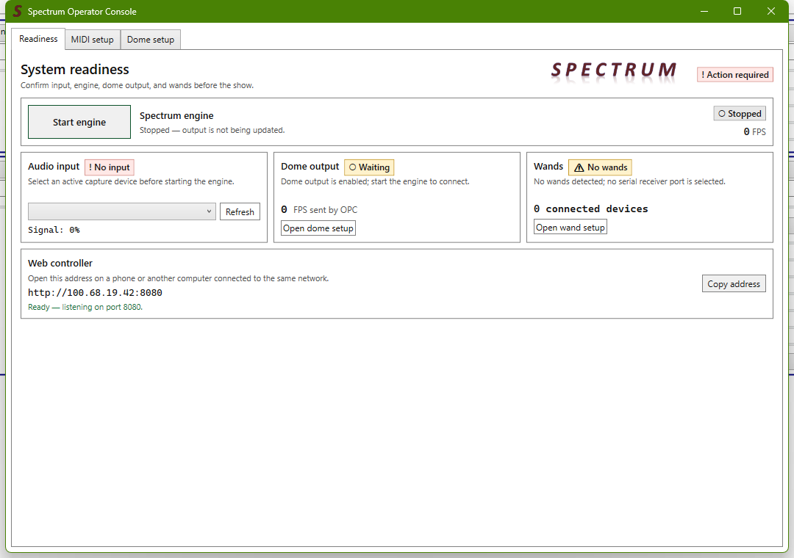
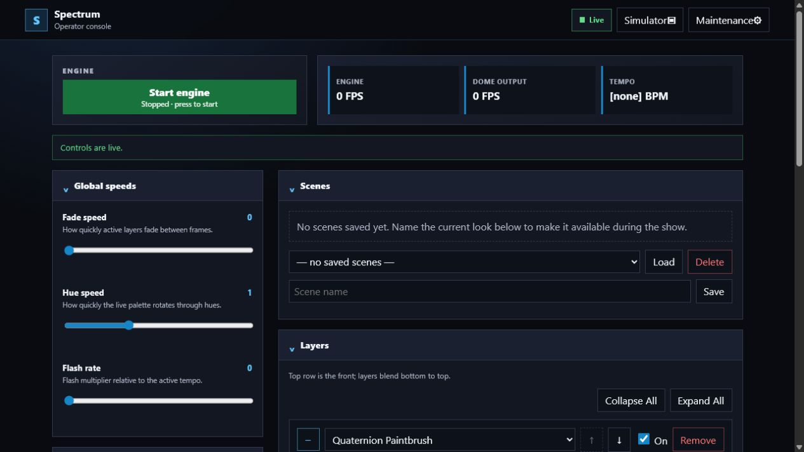

# Dome User Manual

Spectrum has a Windows operator console for starting and configuring the
system, plus a browser controller for running the dome from a computer, tablet,
or phone.

## Setup

### Configure the equipment

- **OPC controller**: Beaglebone network address and port
- **Receiver port**: Serial port for the ESP-NOW receiver
- **Show performance HUD** opens the visualization UI.

The **Advanced output processing** option restarts the engine; leave the dome output on a separate thread unless you have a good reason to

### Calibrate the physical mapping

1. Select **Open dome mapping** on the desktop **Dome setup** tab, or open
   **Maintenance** in the browser and select **Dome mapping calibration**.
2. Follow the guided controller-cable and physical-strip mapping workflow.
3. Finish or cancel the calibration before opening it from another browser or
   native window.

### Browser view

The browser maintenance console collects the setup and diagnostic controls in
one place.

A lock icon means a control owns, or must acquire, an exclusive maintenance
operation. If another browser or native window owns that operation, finish or
cancel it there before continuing.

### Setup troubleshooting

| Symptom | What to check |
| --- | --- |
| Readiness says **No input** | Select an audio capture device, then check that **Signal** responds. |
| Dome output remains at 0 FPS | Start the engine, enable dome output, and verify the OPC host and port. |
| No wands are shown | Select the receiver port in **Dome setup**, then open **Wand status**. |
| A control is locked or disabled | Finish or cancel the mapping/test operation in the browser or native window that owns it. |

## Operation

Operators should not need to change the OPC address, receiver port, physical mapping, or advanced output settings.

### Start a session

1. Open Spectrum on the dome computer.
2. Select **Start engine**.
3. Confirm that the engine and dome FPS values rise and that there are no fault
   messages.

The readiness badge summarizes the system:

- **Spectrum engine** starts and stops live processing.
- **Audio input** shows the selected capture device and signal level.
- **Dome output** reports whether OPC frames are being sent.
- **Wands** reports the receiver and connected-device count.
- **Web controller** shows the address for other devices.

### Open the browser controller

Open the address shown under **Web controller**. On the dome computer,
`http://localhost:8080` also works.

Check the badge in the upper-right corner before making changes:

- **Live** means the page is connected and receiving updates.
- **Connecting** or a warning message means the page is not ready for control.

Most browser changes take effect immediately. To apply an existing look, select
it under **Scenes** and choose **Load**.

### Build and save a look

1. Set the global **Fade speed**, **Hue speed**, and **Flash rate** as needed.
2. In **Palettes**, select a palette and edit its color slots. Enable a
   gradient on a slot to use separate start and end colors.
3. In **Layers**, select the visualizer for each layer and adjust its controls.
4. Set each layer's blend mode and opacity.
5. Enable, disable, add, remove, or reorder layers. The top row is the front;
   layers blend from the bottom upward.
6. Enter a name under **Scenes** and select **Save**.

Use the [visualizer and layer reference](#visualizer-and-layer-reference) for
effect-specific controls and the [blend mode reference](#blend-mode-reference)
for compositing behavior.

A scene saves the layer stack and global fade and hue speeds. Loading it
restores that look, but does not overwrite the colors in the named palettes its
layers use.

- Palette edits are live. **Add copy** makes a new palette without changing the
  current one.
- Saving with an existing scene name asks before overwriting it.
- **Load** replaces the current layer stack and global speeds with the selected
  scene.
- **Delete** permanently removes the selected palette or scene after
  confirmation.
- Layer **Fire** and **Clear** buttons appear only when the selected visualizer
  supports them.

### Visualizer and layer reference

The visualizers below are listed in the same order as the **Visualizer**
selector. Parameter changes take effect immediately.

#### Controls shared by every layer

- **Visualizer** selects the effect rendered by the layer. Changing it resets
  that layer's visualizer-specific parameters to the new visualizer's defaults.
- **Up/Down** changes the compositing order. The top row is the frontmost layer.
- **On** enables or disables the layer without removing its settings.
- **Remove** deletes the layer from the current stack.
- **Notes** stores an operator note with the layer.
- **Blend mode** controls how the layer combines with the layers below it.
- **Opacity** scales the layer's contribution after it is rendered.
- **Palette** selects a named live palette. Editing that palette changes every
  layer that uses it.

Some visualizers also show **Fire**, **Blink**, **Play**, **Stop**, or **Clear**.
These buttons operate only that layer instance. **Fire**, **Blink**, and
**Play** start a manual action; **Stop** halts Astronomy playback; **Clear**
removes the visualizer's accumulated live state.

Triggerable layers use the same trigger controls:

- **Trigger** selects an automatic source: Manual, Beat, or Audio. The layer's
  action button remains available with any selection.
- **Button** optionally binds wand button 1, 2, or 3. **Unbound** disables wand
  triggering.
- **Loudness Threshold** sets the minimum input level for an Audio trigger.
- **Audio Interval (ms)** sets the minimum time between Audio triggers.

#### Volume (OG)

An audio-reactive legacy look that fills the dome's physical strut regions as
the input level rises. Its layout and palette gradient move with the beat.

- **Animation Size** — Sets how many concentric dome regions participate.
- **Rotation Speed** — Sets how quickly the strut layout moves to a new center.
- **Gradient Speed** — Sets how quickly colors travel through the palette.
- **Palette** — Selects the named palette used for the strut colors.

#### Radial Effects

Draws audio-sized geometric patterns around a movable center.

- **Effect** — Selects Radar spokes, Pulse rings, Spiral arms, or Bubbles.
- **Size** — Sets the maximum thickness or coverage of the pattern; input
  volume scales the visible result.
- **Frequency** — Sets how many pattern repetitions appear around the dome.
- **Center Angle** — Sets the direction of the pattern's offset center.
- **Center Distance** — Moves that center away from the middle of the dome.
- **Center Speed** — Rotates the offset center around the dome.
- **Rotation Speed** — Rotates or advances the selected pattern.
- **Gradient Speed** — Moves the palette gradient through the pattern.
- **Palette** — Selects the named palette used by the effect.

#### Race

Draws several horizontal racers that circle the dome with fixed combinations
of constant, audio-reactive, and beat-driven motion.

- **Speed** — Adjusts the travel speed of the constant and audio-driven racers.
- **Spacing** — Adds padding between racers; higher values make the bands
  narrower.
- **Palette** — Selects the named palette used by the racers.

#### Snakes

Runs two short paths across connected dome triangles, leaving cycling palette
colors in their wakes.

- **Palette** — Selects the named palette used for the trails.

#### Splat Effect

Places a random fading color splat once per measure. Louder audio produces a
larger splat.

- **Palette** — Selects the named palette used for new splats.

#### Quaternion Paintbrush

A legacy all-in-one wand look that combines orientation-driven paint fields,
stamps, expanding ripples, and white twinkles. Audio and beat timing animate
parts of the effect.

- **Size** — Sets the size of the orientation-driven paint field.
- **Twinkle Density** — Sets how often random white twinkles appear.
- **Ripple Cooldown** — Sets how quickly the next automatic ripple becomes
  available; higher values shorten the wait.
- **Ripple Speed** — Sets how quickly each ripple expands.

#### TV Static

Fills every pixel with rapidly changing random RGB noise.

This visualizer has no visualizer-specific parameters.

#### Twinkle

Creates random bright white points high on the dome and fades them into the
current stack.

- **Density** — Sets how frequently new twinkles appear.

#### Flash

Flashes the entire dome with one color, then fades it using the global fade
speed.

- **Color** — Sets the flash color.
- **Trigger** — Selects Manual, Beat, or Audio triggering.
- **Button** — Optionally binds a wand button.
- **Loudness Threshold** — Sets the Audio trigger level.
- **Audio Interval (ms)** — Limits how frequently Audio can trigger a flash.
- **Fire** — Immediately starts a flash.

#### Background

Fills the entire layer with a solid color. It is usually placed at the bottom
of the stack so transparent areas above it remain lit.

- **Color** — Sets the fill color.

#### Earth

Wraps an Earth texture around the physical dome. A moving or spotlighted wand
sets the globe's pole; otherwise the globe follows the idle orientation.

- **Spin Speed (rev/s)** — Sets longitude rotation speed. Negative values
  reverse the direction.

#### Astronomy

Renders an approximate Black Rock City sky with the Sun, Moon, visible planets,
bright stars, and a deterministic faint-star field. It is a lighting effect,
not a navigation instrument.

- **North Heading (deg clockwise)** — Aligns true north to the physical dome.
- **Start Date** — Sets the first day of the simulated week in Pacific time.
- **Time (hours from start)** — Scrubs up to one week forward from midnight on
  the start date.
- **Show Daytime Sky** — Shows or hides the daytime sky.
- **Show Nighttime Sky** — Shows or hides the nighttime sky and stars.
- **Playback Speed (x)** — Sets the rate of automatic timeline playback.
- **Loop** — Restarts playback when it reaches the end of the week.
- **Play** — Starts or resumes timeline playback.
- **Stop** — Stops playback at the current simulated time.

#### Wave

Draws a colored band that sweeps across the dome around a configurable center.
It can loop continuously or run once when fired.

- **Band Width** — Sets the thickness of the moving band.
- **Sweep Speed** — Sets speed and direction; negative values reverse it.
- **Center Angle** — Sets the direction of the sweep's offset center.
- **Center Distance** — Moves the sweep center away from the dome center.
- **Color** — Sets the band color.
- **Playback Mode** — **Loop** runs continuously; **OneShot** waits for a
  manual or wand trigger and then crosses the dome once.
- **Button** — Optionally binds a wand button for OneShot playback.
- **Fire** — Starts or restarts a OneShot sweep.

#### Ripple

Launches a colored ring from the current wand or idle aim. Successive ripples
alternate between a fixed center and one that follows the wand.

- **Ripple Speed** — Sets how quickly the ring expands.
- **Desaturation** — Removes color from the ring as the value increases.
- **Trigger** — Selects Manual, Beat, or Audio triggering.
- **Button** — Optionally binds a wand button.
- **Loudness Threshold** — Sets the Audio trigger level.
- **Audio Interval (ms)** — Limits how frequently Audio can launch a ripple.
- **Fire** — Immediately launches a ripple when the current ripple permits it.

#### Stamp

Places a short-lived shape at the current wand or idle aim. Each trigger
alternates between a grid of rings and a beat-driven rhythm band; position and
color remain fixed for that stamp.

- **Trigger** — Selects Manual, Beat, or Audio triggering.
- **Button** — Optionally binds a wand button.
- **Loudness Threshold** — Sets the Audio trigger level.
- **Audio Interval (ms)** — Limits how frequently Audio can place a stamp.
- **Fire** — Immediately places the next stamp.

#### Tunnel

Runs concentric rings from the crown toward the rim. Each ring has a stable
variation in speed, thickness, and brightness.

- **Ring Count** — Sets the number of rings in circulation.
- **Travel Speed** — Sets how quickly rings move toward the rim.
- **Ring Thickness** — Sets the width of every ring.
- **Brightness** — Sets the base ring intensity.
- **Ring Variation** — Sets how different individual rings are from one
  another.
- **Bind to Orientation** — Rotates the tunnel axis with the wand or idle
  orientation.
- **Color** — Sets the ring color.

#### Metaball

Draws a live potential field around wand orientations, with optional animated
contour lines. A trigger briefly enlarges the field.

- **Size** — Sets the base size of the metaball field.
- **Show Contours** — Adds animated level curves to the field.
- **Button** — Optionally binds a wand button to the size burst.
- **Fire** — Immediately starts a size burst.

#### Magnetic Field

Treats every wand as a positive pole at its aim and a negative pole at its
antipode. Colored charge regions and optional white streamlines show the
combined signed field.

- **Field Strength** — Sets how quickly the field reaches full brightness near
  a pole.
- **+1 Color** — Sets the positive-field color.
- **-1 Color** — Sets the negative-field color.
- **Field Lines** — Sets the number of white streamlines; zero hides them.
- **Line Width** — Sets the thickness of the streamlines.

#### Point Cloud

Scatters glowing spots over the dome. Moving wands push nearby spots along the
surface; springs return them toward their resting constellation.

- **Spot Count** — Sets the population and reseeds the constellation when
  changed.
- **Spot Size** — Sets the drawn radius of each spot.
- **Push Radius** — Sets how far each wand's influence reaches.
- **Push Strength** — Sets how strongly a wand repels nearby spots.
- **Spring Strength** — Sets how strongly spots return to their home positions.
- **Damping** — Sets how much velocity is retained; higher values coast longer,
  while lower values settle faster.

#### Gyroscope

Renders three nested gimbal rings driven by the current wand or idle
orientation, with a moving highlight around the inner rotor.

- **Ring Width** — Sets the thickness of all three gimbal rings.
- **Rotor Speed** — Sets the speed of the highlight around the rotor.
- **Palette** — Uses the first three colors for the outer, middle, and inner
  rings.

#### Watchful Iris

Turns the full dome into an eye that follows the current orientation. Audio
dilates the pupil, and the eye can blink manually, on beats, or on audio
transients.

- **Iris Complexity** — Sets the number of radial iris filaments.
- **Pupil Size** — Sets the resting pupil radius.
- **Dilation Gain** — Sets how strongly audio enlarges the pupil.
- **Blink Trigger** — Selects Manual, Beat, or Audio Transient blinking.
- **Eyelid Softness** — Softens the resting eyelid edge and blink transition.
- **Sclera Brightness** — Sets the brightness of the white, blush, and vascular
  surface.
- **Palette** — Selects the iris colors.
- **Blink** — Immediately blinks the eye.

#### Shooting Star

Spawns stars just outside the rim and accelerates them toward the current wand
or idle aim, leaving fading streaks. Triggers add an extra star to the steady
spawn rate.

- **Spawn Rate** — Sets the continuous number of stars created per second.
- **Acceleration** — Sets how strongly stars accelerate toward their targets.
- **Max Speed** — Caps star travel speed.
- **Dot Size** — Sets the drawn size of each star.
- **Homing** — When enabled, stars follow the live moving aim; when disabled,
  each star keeps the target captured at spawn.
- **Trigger** — Selects Manual, Beat, or Audio triggering for extra stars.
- **Button** — Optionally binds a wand button.
- **Loudness Threshold** — Sets the Audio trigger level.
- **Audio Interval (ms)** — Limits how frequently Audio adds a star.
- **Palette** — Selects colors for the star volley.
- **Fire** — Launches one extra star.
- **Clear** — Removes the current stars and accumulated state.

#### Sparkler

Continuously emits colored particles from the current wand or idle aim in
random directions. Triggers add an extra spark.

- **Emission Rate** — Sets the continuous number of particles emitted per
  second.
- **Speed** — Sets particle travel speed.
- **Dot Size** — Sets the drawn size of each particle.
- **Trigger** — Selects Manual, Beat, or Audio triggering for extra sparks.
- **Button** — Optionally binds a wand button.
- **Loudness Threshold** — Sets the Audio trigger level.
- **Audio Interval (ms)** — Limits how frequently Audio adds a spark.
- **Palette** — Selects the spark colors.
- **Fire** — Emits one extra particle.
- **Clear** — Removes current particles and accumulated state.

#### Noise Cloud

Creates a seamless animated fractal-noise texture. It works well beneath Add,
Screen, or Multiply to break up a flat layer.

- **Scale** — Sets the spatial frequency; higher values produce smaller cloud
  features.
- **Morph Speed** — Sets how quickly the cloud changes in place; zero freezes
  it.
- **Detail** — Adds finer layers of noise.
- **Contrast** — Strengthens the difference between bright and dark regions.
- **Color** — Sets the cloud tint.

#### Caustics

Creates the moving filament pattern of light seen on the floor of a sunlit
pool. It can also provide a displacement field to the Refract blend mode.

- **Method** — **Shimmer** uses soft bands, **Interference** produces a classic
  caustic web, and **Lens** models focusing through a moving water surface.
- **Scale** — Sets the spatial frequency and feature size.
- **Speed** — Sets how quickly the pattern churns.
- **Sharpness** — Makes bright filaments broader or thinner.
- **Brightness** — Sets output gain.
- **Color** — Sets the caustic tint.

#### Ripple Tank

Simulates a damped water surface. Moving wands press wakes into the surface;
with no wand motion, an idle orientation supplies a gentle wake.

- **Wave Speed** — Sets how quickly waves cross the surface.
- **Damping** — Sets how quickly existing waves lose energy.
- **Sharpness** — Sets how tightly wave highlights are focused.
- **Brightness** — Sets output gain.
- **Color** — Sets the water-light tint.
- **Clear** — Flattens the simulated surface.

#### Vortex

Creates a procedural particle-like vortex with persistent trails and optional
audio or beat response.

- **Style** — **Whirlpool** draws broad spiral wisps; **Sandstorm** draws finer
  thresholded grains.
- **Spin Speed** — Sets speed and direction of rotation.
- **Audio Brightness** — Scales vortex brightness with the audio input level.
- **Beat Speed** — Adds a short motion impulse on each beat.
- **Twist** — Sets the curvature and angular shear of the spiral.
- **Grain Scale** — Sets the procedural field's spatial frequency.
- **Density** — Sets the amount of visible material.
- **Core Size** — Sets the radius of the dark center.
- **Inflow** — Sets the rate and direction of radial flow.
- **Turbulence** — Adds fine irregularity to the field.
- **Color** — Sets the vortex tint.

#### Living Skin

Runs a persistent reaction-diffusion simulation over the dome. Manual or beat
seeds grow into organic patterns, and wand buttons can feed, poison, or erase
the chemistry under the aim.

- **Feed Rate** — Controls how quickly the first chemical is replenished and
  strongly affects the resulting pattern.
- **Kill Rate** — Controls how quickly the second chemical is removed and
  strongly affects the resulting pattern.
- **Diffusion Scale** — Selects how broadly chemicals spread across neighboring
  LEDs.
- **Simulation Speed** — Sets how quickly the chemistry advances.
- **Seed Source** — Uses the initial/manual seed only, or adds a seed on beats.
- **Edge Contrast** — Emphasizes boundaries in the chemical field.
- **Feed Button** — Binds a held wand button that adds feed chemical.
- **Poison Button** — Binds a held wand button that adds the second chemical.
- **Erase Button** — Binds a held wand button that clears chemistry.
- **Brush Radius** — Sets the size of the wand chemistry brush.
- **Brush Strength** — Sets how quickly a held brush changes the field.
- **Palette** — Selects colors for the chemical concentrations and edges.
- **Fire** — Injects a seed patch.
- **Clear** — Clears the active second chemical until the layer is seeded
  again.

#### Arc Lightning

Routes connected lightning bolts over the physical dome graph. A strike can
branch, widen across neighboring LEDs, and leave a fading afterglow.

- **Branch Count** — Sets the number of side branches on a strike.
- **Jaggedness** — Sets how strongly the main route deviates from a direct
  path.
- **Width** — Expands the energized path across neighboring LEDs.
- **Afterglow (s)** — Sets the half-life of light after the strike.
- **Strike Duration (s)** — Sets how long the live bolt remains energized.
- **Trigger** — Selects Manual, Beat, or Audio triggering.
- **Button** — Optionally binds a wand button.
- **Loudness Threshold** — Sets the Audio trigger level.
- **Audio Interval (ms)** — Limits how frequently Audio creates a strike.
- **Palette** — Selects bolt and branch colors.
- **Fire** — Starts a strike.
- **Clear** — Removes the live strike and afterglow state.

#### Glass Mosaic

Treats the dome's triangular faces as stained-glass tiles. A trigger starts at
the current aim and propagates a connected color-change cascade.

- **Tile Grouping** — Sets how many connected faces change as one tile group.
- **Cascade Speed (tiles/s)** — Sets how quickly the cascade advances.
- **Propagation Rule** — Selects Neighbor Wave, Clockwise Wave, or Random
  Domino ordering.
- **Border Brightness** — Sets the resting brightness of shared tile edges.
- **Tile Transition** — Changes colors instantly or uses an edge-on Flip.
- **Trigger** — Selects Manual, Beat, or Audio triggering.
- **Button** — Optionally binds a wand button.
- **Loudness Threshold** — Sets the Audio trigger level.
- **Audio Interval (ms)** — Limits how frequently Audio starts a cascade.
- **Palette** — Selects the tile colors.
- **Fire** — Starts a cascade.
- **Clear** — Clears the active cascade state.

#### Cellular Dome

Runs a binary cellular automaton on the dome's triangular faces. Cells are born,
survive, age through palette colors, and can advance on a timer or beat.

- **Rule** — Selects Colonies, Oscillators, Traveling Fronts, or Chaos behavior.
- **Neighborhood** — Uses only faces across shared edges or all faces touching
  shared vertices.
- **Generation Rate (gen/s)** — Sets the update rate in Timed mode.
- **Birth Color** — Selects which palette slot a newly born cell uses.
- **Age Decay (s)** — Sets how quickly surviving cells dim and move through
  later palette slots.
- **Trigger Mode** — **Timed** uses Generation Rate, **Beat Step** advances one
  generation per beat, and **Beat Rule Cycle** also selects the next rule.
- **Palette** — Selects colors for born and aging cells.
- **Fire** — Injects a live colony.
- **Clear** — Empties the automaton.

#### Firefly Swarm

Maintains a flock of luminous agents over the dome. Wands attract or repel the
flock, and a sharp audio rise startles it outward before it regroups.

- **Population** — Sets the number of fireflies.
- **Cohesion** — Sets how strongly agents gather into a flock.
- **Separation** — Sets how strongly nearby agents avoid crowding.
- **Wander** — Sets autonomous directional variation.
- **Wand Interaction** — Makes moving wand aims attract or repel the flock.
- **Dot Size** — Sets the size of each firefly.
- **Trail Half-Life (s)** — Sets how long rendered trails remain.
- **Palette** — Selects the firefly colors.

#### Rain Chamber

Spawns droplets at the crown and pulls them toward the rim. Audio controls the
amount of rain, wands modify local rainfall, and rim impacts create splash
rings.

- **Rainfall Rate (drops/s)** — Sets the base spawn rate; input volume scales
  the result.
- **Spherical Gravity** — Sets how strongly droplets accelerate toward the rim.
- **Droplet Size** — Sets the rendered droplet size.
- **Trail Half-Life (s)** — Sets how long droplet trails remain.
- **Wand Interaction** — **Umbrella** deflects droplets, **Dry Region** clears
  rain near the aim, and **Wind** uses wand motion to push droplets.
- **Wand Strength** — Sets the strength of the selected interaction.
- **Splash Strength** — Sets the size and brightness of rim-impact splashes.
- **Palette** — Selects droplet and splash colors.

#### Topographic Dream

Draws a seamless evolving landscape directly on the dome, with subdued land
and water fills, bright contours, and a coastline. Audio raises the sea level.

- **Terrain Scale** — Sets the size and frequency of terrain features.
- **Evolution Speed** — Sets how quickly the landscape changes.
- **Contour Interval** — Sets the elevation spacing between contour lines.
- **Line Width** — Sets contour and coastline thickness.
- **Quiet Sea Level** — Sets the baseline water level before audio raises it.
- **Follow Orientation** — Rotates the landscape with the wand or idle
  orientation.
- **Palette** — Selects land, water, contour, and coastline colors.

#### Orbital Garden

Maintains luminous bodies orbiting gravity wells created by connected wands.
Without wands, a fixed fallback well keeps the system moving.

- **Body Count** — Sets the number of persistent orbiting bodies.
- **Gravity** — Sets attraction strength toward wand gravity wells.
- **Orbital Damping** — Sets how quickly orbital motion loses energy.
- **Collisions** — **Bounce** keeps collisions elastic, **Bloom** adds a light
  burst, and **Fragment Bloom** also launches temporary fragments.
- **Trail Half-Life (s)** — Sets how long orbital trails remain.
- **Body Size** — Sets the size of bodies, wells, fragments, and blooms.
- **Palette** — Selects colors for the garden.

#### Lava Lamp Sky

Moves large soft blobs over the dome. Warm blobs rise, cool blobs sink, nearby
blobs merge visually, and audio increases heat and buoyancy.

- **Blob Count** — Sets the number of persistent blobs.
- **Viscosity** — Sets resistance to motion; higher values produce heavier,
  slower movement.
- **Buoyancy** — Sets how strongly temperature moves blobs along gravity.
- **Surface Tension** — Encourages nearby blobs to merge and return to rounded
  shapes.
- **Heat** — Sets the base blob temperature before audio response.
- **Follow Orientation** — Tilts the gravity axis with the wand or idle
  orientation instead of fixing it at the crown.
- **Palette** — Selects the blob colors.

### Blend mode reference

A blend mode determines how one layer changes the composite built from the
layers below it. Because Spectrum composites from the bottom upward, changing
the order of two layers can produce a completely different result.

There are two broad families:

- **Paint blends** use the visualizer's rendered colors. Over, Add, Screen,
  Lighten, and Multiply belong to this family.
- **Adjustment blends** primarily use the visualizer's coverage as a mask and
  reprocess the already-composited layers below. A full-dome visualizer such as
  Background applies an adjustment everywhere; a Wave, Ripple, or other
  partially transparent visualizer restricts it to that moving shape.

The layer's **Opacity** always controls the strength of the selected blend, but
its exact role depends on the blend. At 0% the blend has no visible effect. For
paint blends it scales or mixes the source color; for adjustment blends it
scales the adjustment mask.

#### Over

**Over** is conventional foreground compositing. Where the visualizer drew an
opaque pixel, its color replaces the composite below. Partially transparent
pixels mix the source and destination, and transparent areas reveal the lower
layers unchanged.

Use Over when a layer should read as a distinct foreground object: solid
backgrounds, opaque shapes, or effects whose own transparency and soft edges
should be respected.

Opacity multiplies the visualizer's own coverage. At 50%, a fully opaque source
is mixed halfway with the composite below.

Over has no blend-specific controls.

#### Add

**Add** adds the source's red, green, and blue values to the composite below.
Black adds nothing; brighter colors increase the corresponding channels. When
several bright layers overlap, the result can reach the output ceiling and
become white.

Add is the default for new layers. It works especially well for light-emitting
effects such as Twinkle, Sparkler, Shooting Star, lightning, and highlights,
where overlapping light should become brighter.

Opacity scales the source color before it is added. Lower it when overlapping
effects clip, lose color, or make the dome too bright.

Add has no blend-specific controls.

#### Screen

**Screen** is another lightening blend. It combines the inverse of the source
and destination, so black has no effect and white produces white. Unlike Add,
it approaches white progressively instead of summing channel values directly.

Screen is useful for glows, atmospheric textures, caustics, and other bright
overlays that should lighten the look while retaining more detail and color
than a strong additive stack.

Opacity reduces the source's contribution before the screen calculation.

Screen has no blend-specific controls.

#### Lighten

**Lighten** compares each color channel and keeps whichever is brighter: the
existing composite or the opacity-scaled source. It does not sum the two.

Use Lighten for crisp sparkles, highlights, or competing bright patterns when
you want the strongest value to win without making overlaps progressively
brighter. Because the comparison happens independently for red, green, and
blue, overlapping colors can combine into a new color.

Opacity scales the source before the comparison. Reducing it raises the bar a
source pixel must clear before it replaces a destination channel.

Lighten has no blend-specific controls.

#### Multiply

**Multiply** multiplies the composite below by the source color. White leaves
the lower composite unchanged, midtones tint and darken it, and black produces
black.

Use Multiply for shadows, cloud textures, patterned dimming, color filtering,
and adding surface variation to a bright base layer. It needs illuminated
content below it; multiplying black cannot create light.

Multiply uses the source's RGB values rather than its transparency. A
visualizer whose unused pixels are black will darken those areas too, so
full-frame sources such as Background or Noise Cloud are usually the most
predictable choices.

Opacity moves the multiplier toward white: 0% is no change and 100% applies the
source color fully.

Multiply has no blend-specific controls.

#### Desaturate

**Desaturate** ignores the visualizer's RGB color and uses only its coverage as
a mask. Inside that mask, the composite below is converted toward grayscale
using its perceived brightness.

Use a full-dome source to desaturate the entire look, or a moving source such as
Wave to sweep a grayscale region across colored layers. The source's displayed
color is irrelevant; only where it draws and how transparent it is matter.

Opacity sets the amount of desaturation. At 50%, the destination is mixed
halfway toward grayscale.

Desaturate has no blend-specific controls.

#### Hue

**Hue** is a specialized adjustment blend. The source provides coverage and
brightness, but not its own hue or saturation. Spectrum recolors that shape at
full saturation using the hue carried upward by the composite below.

This is most useful above a visualizer that publishes a meaningful per-pixel
hue field, such as Metaball or another colored paint layer. For example, a
white Wave using Hue can become a moving, fully saturated window into the hue
field below. If the lower stack does not carry a useful hue, the result may be
uniform or surprising.

The source's brightest channel sets the output brightness. Source alpha and
layer opacity set the adjustment mask.

Hue has no blend-specific controls.

#### ChromaticFringe

**ChromaticFringe** creates RGB channel separation in the composite below. Red
is sampled from one side of each pixel, blue from the opposite side, and green
stays centered. This produces a lens-aberration or misregistered-projector
look.

The selecting visualizer supplies only the mask. Use Background for a
full-dome fringe, or a moving shape to reveal the split locally.

- **Fringe Offset** — Sets the distance between the red and blue samples.
  Small values produce a tight colored edge; large values visibly separate the
  channels.
- **Angle Spin** — Rotates the split axis over time. Positive and negative
  values rotate in opposite directions; zero holds a fixed axis.
- **Follow Orientation** — Uses the current wand or idle orientation angle for
  the split axis. While an orientation angle is available, it replaces Angle
  Spin.

Opacity controls how strongly the separated channels replace the original
composite inside the mask.

#### EdgeSpectrum

**EdgeSpectrum** finds brightness edges in the composite below and adds spectral
color along them. The hue follows the direction of the local brightness
gradient, so differently oriented edges receive different colors. Flat regions
remain unchanged.

It is useful for outlining geometry, revealing fine motion in subdued layers,
or adding a colored energy edge without replacing the underlying image.

- **Edge Strength** — Sets the brightness of the added spectral outline.
- **Sample Radius** — Sets how far apart the edge detector samples the
  composite. Small values find fine edges; larger values respond to broader
  transitions.

The source visualizer supplies the mask, and opacity scales the added edge
color.

#### Iridescence

**Iridescence** adds a thin-film spectral sheen based on the physical curvature
of the dome. A virtual light direction selects a rainbow tint from each
pixel's surface angle. The tint is scaled by the destination's existing
brightness, so dark areas stay dark.

Use it to give solid objects, landscapes, or full-dome textures an oil-slick,
pearl, or interference-film appearance without losing their brightness
structure.

- **Sheen Strength** — Sets how far the existing color is recolored toward the
  spectral tint.
- **Spectral Bands** — Sets how many rainbow cycles repeat across the dome's
  curvature.
- **Light Spin** — Rotates the virtual light around the dome. Positive and
  negative values rotate in opposite directions.
- **Follow Orientation** — Uses the current wand or idle orientation angle for
  the virtual light. While an orientation angle is available, it replaces
  Light Spin.

The source visualizer supplies the mask. Layer opacity and Sheen Strength both
scale the recoloring.

#### Refract

**Refract** distorts the composite below as though it were viewed through a
moving surface. Each masked pixel samples a nearby destination pixel; the
source layer provides both the displacement direction and magnitude.

Caustics and Ripple Tank are designed to publish the displacement data Refract
expects. With either one, the visible source paint is replaced by a shimmer or
water-lens distortion of the lower stack. Other visualizers may provide no
useful displacement field and can produce little or unpredictable movement.

- **Refraction Strength** — Sets the maximum sampling displacement. Low values
  create subtle shimmer; high values create stronger warping.

The source field's own magnitude controls both local displacement and coverage.
Layer opacity scales how strongly the displaced sample replaces the original.

#### Kaleidoscope

**Kaleidoscope** folds the top-down projection of the composite below into
repeated angular sectors. The selecting visualizer supplies only the mask; its
color is ignored.

Use a full-dome mask to transform the entire composition, or a patterned mask
to reveal kaleidoscopic regions inside an otherwise normal look.

- **Sector Count** — Sets the number of angular repetitions.
- **Sector Mode** — **Repeat** copies every sector with the same orientation;
  **Mirror** flips alternating sectors for a traditional kaleidoscope seam.
- **Sector Spin** — Rotates the entire folded pattern over time. Positive and
  negative values rotate in opposite directions.
- **Focal Angle** — Sets the direction in which the folding center is offset.
- **Focal Distance** — Moves the folding center away from the center of the
  dome. At zero, Focal Angle has no visible effect.
- **Follow Orientation** — Uses the current wand or idle orientation angle as
  the Focal Angle. Sector Spin continues to rotate the folded pattern.

Opacity mixes the folded sample with the original composite inside the mask.

#### Echo

**Echo** stores the composite below and screens delayed, transformed copies back
over the current frame. Each older copy can rotate, scale, drift, fade, shift
hue, and lose saturation. Because it reads real history, motion creates trails
and repeated silhouettes while static content tends to overlap itself.

The selecting visualizer supplies the mask. A full-dome mask shows complete
frame echoes; a moving or partial mask confines them to selected regions.

- **Copy Count** — Sets how many delayed frames are composited.
- **Copy Delay** — Sets the time in seconds between successive historical
  copies.
- **Rotation Per Copy** — Adds a signed rotation step to each older copy.
- **Scale Per Copy** — Multiplies scale for each copy. Values below 1 shrink
  older echoes; values above 1 enlarge them.
- **Drift Per Copy** — Adds a position offset to each successive copy.
- **Drift Direction** — Sets the direction of that offset.
- **Copy Decay** — Multiplies the intensity of each successive copy. Lower
  values make older echoes disappear sooner.
- **Hue Shift Per Copy** — Rotates each copy farther around the color wheel.
- **Saturation Per Copy** — Multiplies saturation for each successive copy.
  Values below 1 make older echoes progressively paler.

Opacity scales the screened echo copies inside the source mask; it does not
remove the undelayed composite below.

#### Halftone

**Halftone** replaces the masked composite with a regular field of luminous
cells. Each cell samples the brightness of the composite below. Brighter source
areas produce larger cells, while the selected palette supplies their color.

Dots and Triangles use the dome's top-down projection. Strut Segments follow
physical LED addressing, keeping their breaks coherent along installed
hardware.

- **Cell Type** — Selects Dots, Triangles, or Strut Segments.
- **Cell Scale** — Sets cell spacing and overall feature size.
- **Brightness Threshold** — Hides cells whose sampled brightness is below the
  threshold and remaps the remaining brightness range.
- **Minimum Dot** — Sets the smallest occupied portion of a visible cell.
- **Maximum Dot** — Sets the largest occupied portion of a bright cell.
- **Rotation** — Rotates the dot or triangle grid. For Strut Segments it shifts
  the segmentation phase along each strut.
- **Palette** — Maps sampled brightness through the selected named palette.

The source visualizer supplies the mask, and opacity mixes the halftone result
with the original composite.

#### Motion Embers

**Motion Embers** compares the composite below with its previous frame and
replaces the masked region with fading light only where change was detected.
By default, newly brightening areas create a warm ember afterglow and unchanged
areas decay to black.

Use it over animated layers to isolate motion, turn moving edges into glowing
trails, or suppress static scenery. A full-dome mask observes all changes;
partial masks limit both detection output and the visible embers to selected
areas.

- **Change Threshold** — Sets how much frame-to-frame change is required before
  an ember is created. Raise it to ignore small flicker and noise.
- **Ember Brightness** — Sets the gain applied to newly detected motion.
- **Retention Half-Life (s)** — Sets the time for existing embers to lose half
  their brightness. Zero removes them immediately on the next frame.
- **Color Mode** — **Source** uses the changing source color, **Ember Heat**
  maps change strength from warm orange toward white, and **Difference** uses
  the absolute RGB difference between frames.
- **Count Fading as Motion** — Treats pixels becoming darker as motion in
  addition to the default brightening detection.
- **Count Hue Changes as Motion** — Detects color changes even when brightness
  stays similar.

Opacity controls how strongly the ember buffer replaces the current composite
inside the source mask. Motion Embers needs one previous frame before it can
detect a change, so the first rendered frame establishes its baseline.
